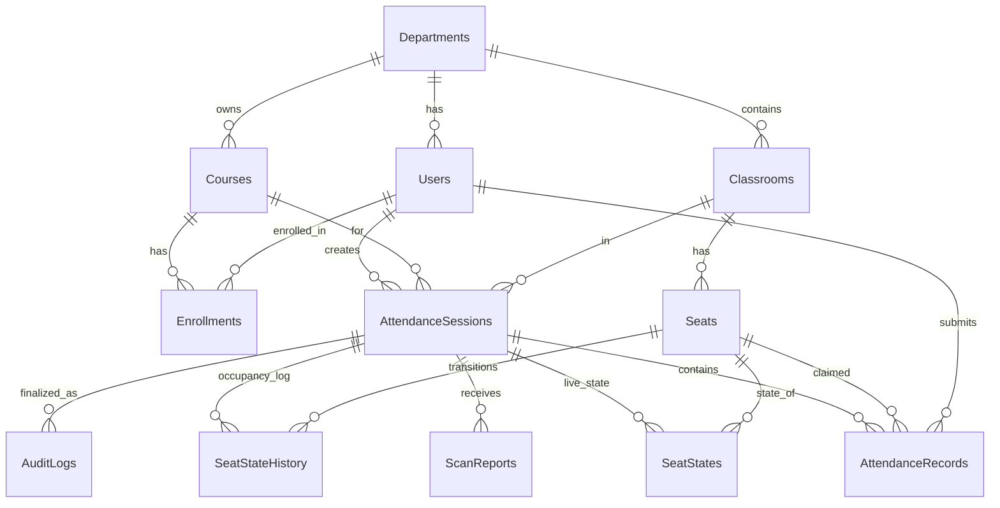

# Phase 3 — Database Schema Design

Design all PostgreSQL tables for the Attendance System, capturing every entity from the requirements. Includes **continuous presence verification** — the system can revoke attendance if a student leaves before meeting a minimum presence threshold.

---

## Proposed Changes

### [NEW] Database Schema

The schema is designed around the following **12 tables** derived directly from the functional requirements. The ER diagram below shows all relationships:



---

### Tables

#### 1. `departments`
University departments. HoD access is scoped to a department.

| Column | Type | Constraints |
|--------|------|-------------|
| `id` | UUID | PK, default `gen_random_uuid()` |
| `name` | VARCHAR(150) | NOT NULL, UNIQUE |
| `created_at` | TIMESTAMPTZ | NOT NULL, default `now()` |

> Satisfies: FR-S20 (department-level HoD authorization)

---

#### 2. `users`
All human actors: Student, Lecturer, HoD.

| Column | Type | Constraints |
|--------|------|-------------|
| `id` | UUID | PK |
| `email` | VARCHAR(255) | NOT NULL, UNIQUE |
| `hashed_password` | VARCHAR(255) | NOT NULL |
| `full_name` | VARCHAR(200) | NOT NULL |
| `role` | ENUM(`student`, `lecturer`, `hod`) | NOT NULL |
| `student_id` | VARCHAR(50) | UNIQUE, nullable (students only) |
| `department_id` | UUID | FK → `departments.id`, NOT NULL |
| `is_active` | BOOLEAN | NOT NULL, default `true` |
| `created_at` | TIMESTAMPTZ | NOT NULL, default `now()` |

> Satisfies: FR-S01, FR-S02

---

#### 3. `courses`
Courses offered by a department.

| Column | Type | Constraints |
|--------|------|-------------|
| `id` | UUID | PK |
| `code` | VARCHAR(20) | NOT NULL, UNIQUE |
| `name` | VARCHAR(200) | NOT NULL |
| `department_id` | UUID | FK → `departments.id`, NOT NULL |
| `lecturer_id` | UUID | FK → `users.id`, NOT NULL |
| `created_at` | TIMESTAMPTZ | NOT NULL, default `now()` |

> Satisfies: FR-S03, FR-S10

---

#### 4. `enrollments`
Many-to-many link: which students are enrolled in which courses.

| Column | Type | Constraints |
|--------|------|-------------|
| `id` | UUID | PK |
| `student_id` | UUID | FK → `users.id`, NOT NULL |
| `course_id` | UUID | FK → `courses.id`, NOT NULL |
| `enrolled_at` | TIMESTAMPTZ | NOT NULL, default `now()` |
| | | UNIQUE(`student_id`, `course_id`) |

> Satisfies: FR-S10, FR-M04 (enrollment check)

---

#### 5. `classrooms`
Physical rooms with a known seat layout.

| Column | Type | Constraints |
|--------|------|-------------|
| `id` | UUID | PK |
| `name` | VARCHAR(100) | NOT NULL, UNIQUE |
| `department_id` | UUID | FK → `departments.id`, NOT NULL |
| `building` | VARCHAR(100) | nullable |
| `floor` | INTEGER | nullable |
| `layout_rows` | INTEGER | NOT NULL (grid rows) |
| `layout_cols` | INTEGER | NOT NULL (grid cols) |
| `created_at` | TIMESTAMPTZ | NOT NULL, default `now()` |

> Satisfies: FR-M06, FR-W06 (seat map rendering)

---

#### 6. `seats`
Individual seats in a classroom, each mapped to an RFID tag.

| Column | Type | Constraints |
|--------|------|-------------|
| `id` | UUID | PK |
| `classroom_id` | UUID | FK → `classrooms.id`, NOT NULL |
| `label` | VARCHAR(20) | NOT NULL (e.g., "A1", "B5") |
| `row` | INTEGER | NOT NULL |
| `col` | INTEGER | NOT NULL |
| `tag_id` | VARCHAR(100) | NOT NULL, UNIQUE (RFID/NFC tag ID) |
| | | UNIQUE(`classroom_id`, `row`, `col`) |
| | | UNIQUE(`classroom_id`, `label`) |

> Satisfies: FR-S07 (TagID → SeatID mapping)

---

#### 7. `attendance_sessions`
A single lecture session during which attendance is tracked.

| Column | Type | Constraints |
|--------|------|-------------|
| `id` | UUID | PK |
| `course_id` | UUID | FK → `courses.id`, NOT NULL |
| `classroom_id` | UUID | FK → `classrooms.id`, NOT NULL |
| `lecturer_id` | UUID | FK → `users.id`, NOT NULL |
| `status` | ENUM(`active`, `closed`) | NOT NULL, default `active` |
| `t_start` | TIMESTAMPTZ | NOT NULL |
| `t_expiry` | TIMESTAMPTZ | NOT NULL |
| `qr_token` | TEXT | NOT NULL (encoded session payload) |
| `freshness_delta_sec` | INTEGER | NOT NULL, default `120` |
| `min_presence_pct` | INTEGER | NOT NULL, default `75` (0–100, minimum % of session time a student must be seated to keep attendance) |
| `integrity_hash` | VARCHAR(64) | nullable (SHA-256, set on finalization) |
| `created_at` | TIMESTAMPTZ | NOT NULL, default `now()` |
| `finalized_at` | TIMESTAMPTZ | nullable |

> Satisfies: FR-S03–S05, FR-S09, FR-S14–S15, NFR-SEC02

---

#### 8. `seat_states`
Live occupancy per seat during a session (the **SeatStateTable** from the requirements).

| Column | Type | Constraints |
|--------|------|-------------|
| `id` | UUID | PK |
| `session_id` | UUID | FK → `attendance_sessions.id`, NOT NULL |
| `seat_id` | UUID | FK → `seats.id`, NOT NULL |
| `is_occupied` | BOOLEAN | NOT NULL, default `false` |
| `last_seen_at` | TIMESTAMPTZ | nullable |
| | | UNIQUE(`session_id`, `seat_id`) |

> Satisfies: FR-S07, FR-S12, FR-S18 (Digital Twin — live snapshot)

---

#### 8b. `seat_state_history`
Full occupancy transition log — every time a seat flips between occupied / empty. This is the backbone of **continuous presence verification**.

| Column | Type | Constraints |
|--------|------|-------------|
| `id` | UUID | PK |
| `session_id` | UUID | FK → `attendance_sessions.id`, NOT NULL |
| `seat_id` | UUID | FK → `seats.id`, NOT NULL |
| `is_occupied` | BOOLEAN | NOT NULL |
| `detected_at` | TIMESTAMPTZ | NOT NULL (when the Reader saw this transition) |
| `created_at` | TIMESTAMPTZ | NOT NULL, default `now()` |

> **How it works**: Every RFID scan cycle, the server compares the current scan against the previous `seat_states` snapshot. If a seat changed state, a row is appended here. At session finalization, the server reconstructs each student's presence timeline from this log and computes their `presence_pct`.

> Satisfies: Continuous presence verification, FR-S07, FR-S12, FR-S14

---

#### 9. `attendance_records`
One row per student claim attempt.

| Column | Type | Constraints |
|--------|------|-------------|
| `id` | UUID | PK |
| `session_id` | UUID | FK → `attendance_sessions.id`, NOT NULL |
| `student_id` | UUID | FK → `users.id`, NOT NULL |
| `seat_id` | UUID | FK → `seats.id`, NOT NULL |
| `status` | ENUM(`present`, `rejected`, `revoked`) | NOT NULL |
| `rejection_reason` | VARCHAR(100) | nullable |
| `revocation_reason` | VARCHAR(100) | nullable (e.g., "Presence 40% < required 75%") |
| `presence_pct` | INTEGER | nullable (0–100, computed at finalization) |
| `claimed_at` | TIMESTAMPTZ | NOT NULL (timestamp from claim) |
| `processed_at` | TIMESTAMPTZ | NOT NULL, default `now()` |
| `finalized_at` | TIMESTAMPTZ | nullable (when presence was computed) |
| | | UNIQUE(`session_id`, `student_id`) |

> Satisfies: FR-S08–S13, FR-S17
>
> **Revocation flow**: At finalization, the server iterates each `present` record, looks up the student's seat in `seat_state_history`, computes the percentage of session duration the seat was occupied, and if below `min_presence_pct`, flips status to `revoked`.

---

#### 10. `audit_logs`
Immutable, append-only log entries per finalized session.

| Column | Type | Constraints |
|--------|------|-------------|
| `id` | UUID | PK |
| `session_id` | UUID | FK → `attendance_sessions.id`, NOT NULL |
| `event_type` | VARCHAR(50) | NOT NULL (e.g., `session_finalized`) |
| `payload` | JSONB | NOT NULL (session summary snapshot) |
| `integrity_hash` | VARCHAR(64) | NOT NULL (SHA-256) |
| `prev_hash` | VARCHAR(64) | nullable (hash chain for tamper evidence) |
| `created_at` | TIMESTAMPTZ | NOT NULL, default `now()` |

> Satisfies: FR-S15–S16, NFR-SEC03, NFR-DAT01–02

---

#### 11. `scan_reports`
Raw reports received from the RFID Reader device.

| Column | Type | Constraints |
|--------|------|-------------|
| `id` | UUID | PK |
| `session_id` | UUID | FK → `attendance_sessions.id`, NOT NULL |
| `reader_device_id` | VARCHAR(100) | NOT NULL |
| `tags_detected` | JSONB | NOT NULL (array of tag IDs) |
| `scanned_at` | TIMESTAMPTZ | NOT NULL |
| `received_at` | TIMESTAMPTZ | NOT NULL, default `now()` |

> Satisfies: FR-S06, FR-R01–R03

---

### Key Indexes (beyond PKs and UNIQUEs)

| Table | Index | Purpose |
|-------|-------|---------|
| `attendance_sessions` | `(course_id, status)` | Quickly find active sessions for a course |
| `attendance_records` | `(session_id, status)` | Generate reports: all Present per session |
| `seat_states` | `(session_id)` | Fetch full seat map for Digital Twin |
| `seat_state_history` | `(session_id, seat_id, detected_at)` | Reconstruct occupancy timeline per seat |
| `audit_logs` | `(session_id)` | Look up audit trail by session |
| `scan_reports` | `(session_id, scanned_at)` | Time-ordered scan history |

---

### Reader Device Authentication

> [!IMPORTANT]
> Reader devices are not human users — they authenticate via **API keys** stored in the server config, not in the `users` table. The `reader_device_id` in `scan_reports` is a simple identifier string (e.g., `reader-room-101`). This keeps the schema clean and avoids mixing IoT devices into the user model.

---

## Verification Plan

### Automated
1. **Alembic migration test** — After creating the SQLAlchemy models and generating the initial migration, run:
   ```
   cd server
   alembic upgrade head
   ```
   This proves the schema is valid SQL and all constraints/FKs resolve correctly.

2. **Seed script** — We'll write a small script that inserts sample data into every table and queries it back, confirming relationships work.

### Manual
- Review the ER diagram above and the table definitions to confirm nothing from the requirements is missing.
